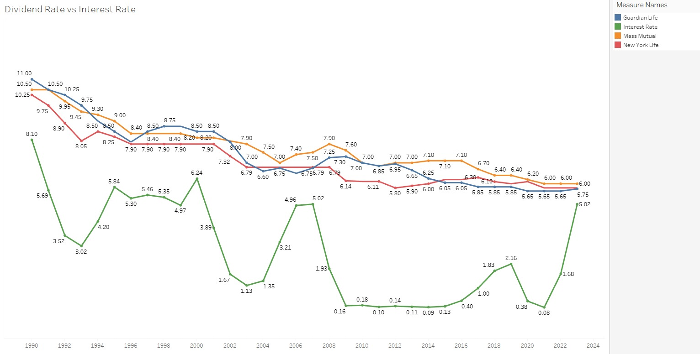
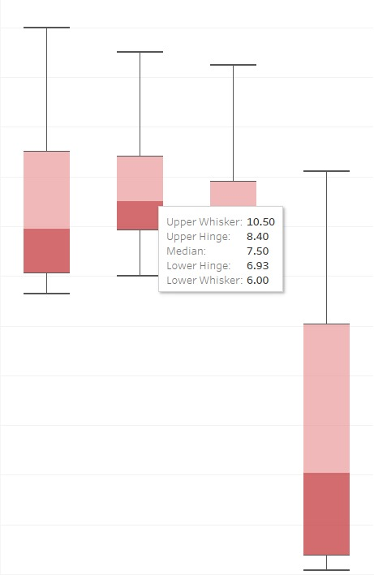
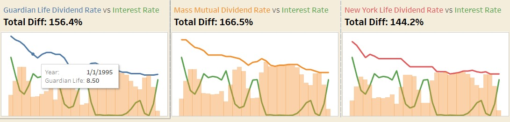
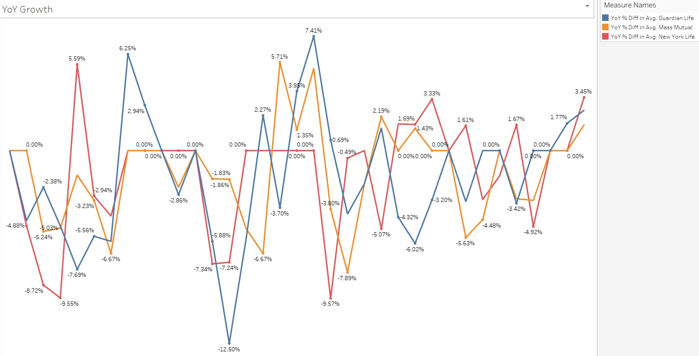
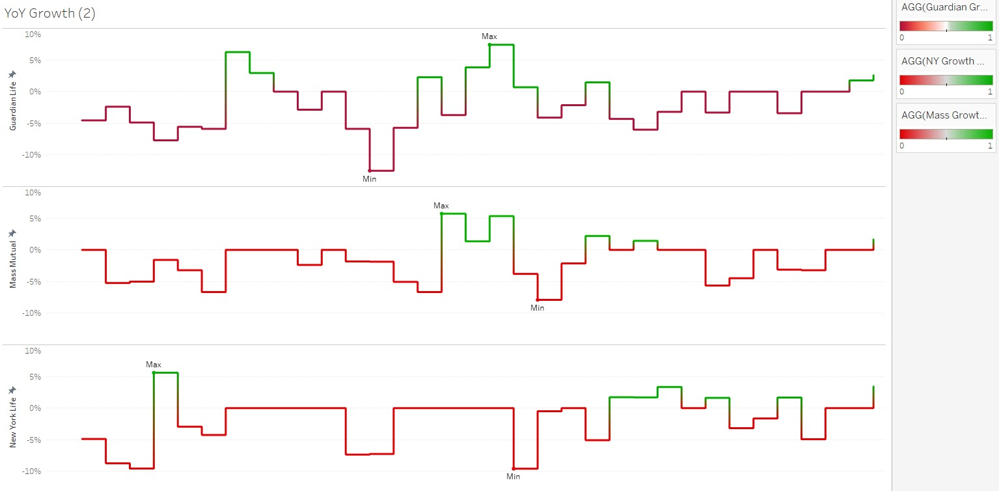
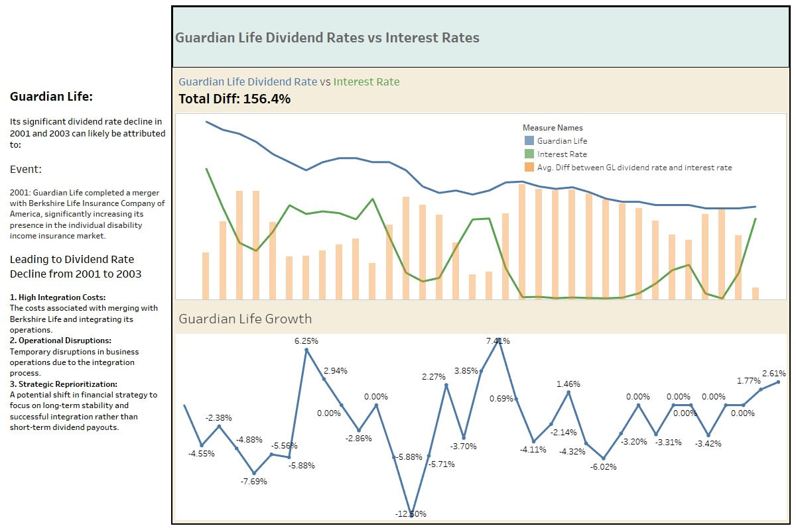
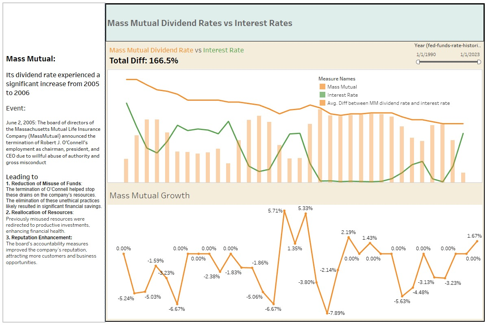
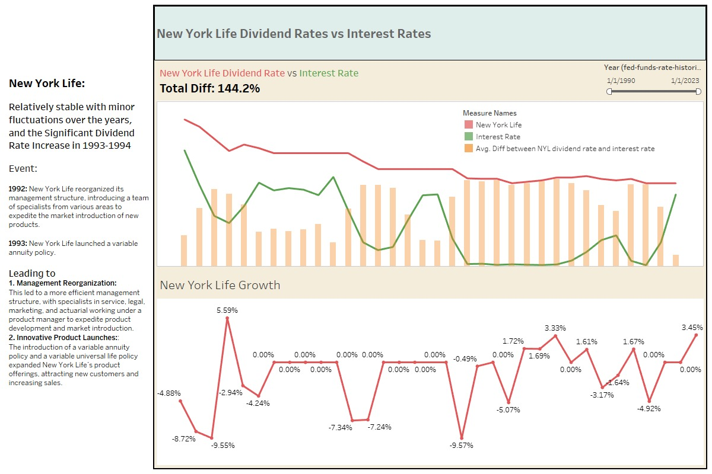
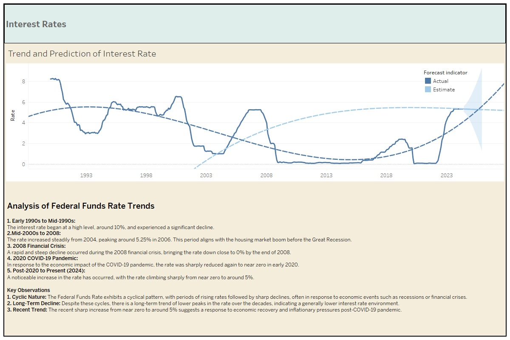

# 🎯 Project Objective 

This project is to create a visualization or series of visualization that analyze the relationship between the dividend rates of New York Life, Guardian Life, and MassMutual and U.S. government interest rates from 1990 to 2024.
My goal is to identify trends, correlations, and insights that assist in evaluating the performance of these insurance companies under various interest rate scenarios.

# 🔍 Data Requirements

Dividend rates from New York Life, Guardian Life, and MassMutual from 1990 to 2024 [Dataset](https://topwholelife.com/whole-life-insurance-dividend-rate-history/).

U.S. government interest rates from 1990 to 2024 [Interest Rates](https://fred.stlouisfed.org/series/FEDFUNDS#0).

# 📊 Data Visualization

- Time Series Line Chart:
    - Display dividend rates of New York Life, Guardian Life, MassMutual, and U.S. government interest rates on the same chart.
    - Use different colors for each company and government rate.
    - X-axis: Years (1990-2024), Y-axis: Rate percentage.
   
      
   

- Dividend Rate Boxplot
   
      
   

- Each Insurance Company Dividend Rate v.s. Interest Rate
   
      
   

- YoY Growth overall
   
      
   

- YoY Growth in each Insurance Company
   
      
   

# 📈 Exploratory Data Analysis  

- Guardian Life Dividend Rate v.s. Interest Rate Analysis
   
      
   

- Mass Mutual Dividend Rate v.s. Interest Rate Analysis
   
      
   

- New York Life Dividend Rate v.s. Interest Rate Analysis
   
      
   

- Interest Rate Analysis
   
      
   

# 👣 My Approach  

1. Data Collection and Preprocessing:
    - Gathered dividend rate data for New York Life, Guardian Life, and MassMutual from 1990 to 2024.
    - Collected U.S. Federal Funds Rate data for the same period.
    - Cleaned and standardized the data for analysis.
2. Time Series Analysis:
    - Created time series plots for each insurance company's dividend rates and the Federal Funds Rate.
    - Identified key trends, fluctuations, and anomalies in the data.
3. Event-based Analysis:
    - Researched significant events for each company and the broader economic context.
    - Correlated these events with observed changes in dividend rates.
4. Comparative Analysis:
    - Compared the dividend rate trends of the three insurance companies.
    - Analyzed the relationship between company dividend rates and the Federal Funds Rate.
5. Statistical Analysis:
    - Calculated correlations between company dividend rates and the Federal Funds Rate.
    - Performed regression analysis to quantify relationships.
6. Visualization:
    - Created various charts and graphs to illustrate findings, including line charts, scatter plots, and heatmaps.

# 🔑 Key Takeaways    
1. Company-Specific Insights:
    - Guardian Life: Significant dividend rate declines in 2001-2003 were likely due to the merger with Berkshire Life, resulting in integration costs and strategic shifts.
    - MassMutual: The notable increase in dividend rates from 2005 to 2006 coincided with leadership changes, suggesting improved financial management and resource allocation.
    - New York Life: Demonstrated relative stability with a significant increase in 1993-1994, potentially due to management restructuring and innovative product launches.
2. Federal Funds Rate Impact:
    - The Federal Funds Rate showed a cyclical pattern with long-term declining trends, punctuated by sharp drops during economic crises.
    - Insurance company dividend rates generally showed less volatility compared to the Federal Funds Rate, suggesting some degree of insulation from short-term interest rate fluctuations.
3. Economic Events and Industry Performance:
    - Major economic events like the 2008 financial crisis and the 2020 COVID-19 pandemic had observable impacts on both the Federal Funds Rate and insurance company dividend rates.
    - The insurance industry demonstrated resilience, with dividend rates generally remaining more stable than broader interest rate trends.
4. Company Strategy and Performance:
    - Each company's unique events and strategies (mergers, leadership changes, product innovations) had discernible impacts on their dividend rates, highlighting the importance of company-specific factors in dividend performance.
5. Long-term Trends:
    - Despite short-term fluctuations, all three insurance companies maintained relatively stable long-term dividend rates, suggesting effective risk management and financial stability strategies.
6. Relationship with Federal Funds Rate:
    - While there is some correlation between insurance dividend rates and the Federal Funds Rate, the relationship is not direct or immediate, indicating that other factors significantly influence insurance company dividend decisions.

# ☁️ Project Improvements  
1. Data Expansion and Integration:
    - Include additional economic indicators such as inflation rates, GDP growth, and stock market performance.
2. Advanced Analytics and Machine Learning:
    - Conduct more sophisticated regression analyses, including multivariate regressions, to better understand the factors influencing dividend rates.
3. Interactive Visualization and User Experience:
    - Implement user input features allowing customization of date ranges and company selections for comparison.

 
